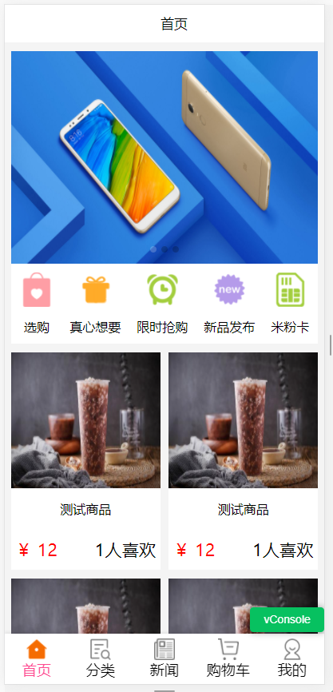
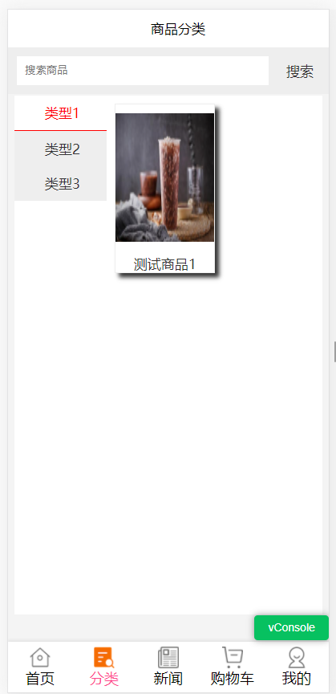
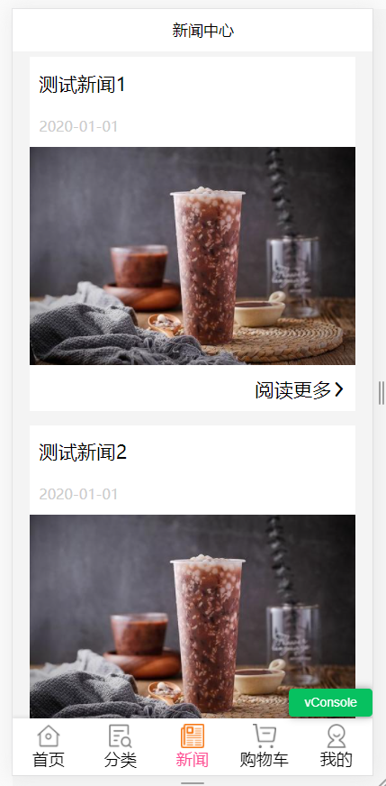
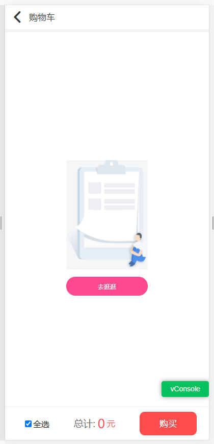
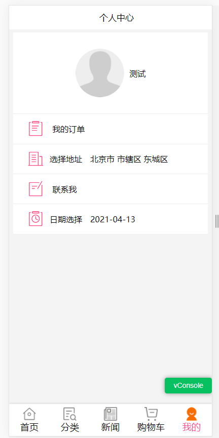

# vue搭建移动端H5界面模版
------------------------ 


#### 技术栈
vue2 + vuex + vue-router + webpack + ES6/7 + axios + elementUI + 阿里图标iconfont

#### 项目分支
master V1.0
develop 开发分支


#### 说明

>  本项目主要用于熟悉如何用 vue2 架构一个H5项目

>  为了方便后期修改使用，模拟数据在页面中，具体修改看下面【强调】

>  如果对您有帮助，您可以点右上角 "Star" 支持一下 谢谢！ ^_^

>  或者您可以 "follow" 一下，我会不断开源更多的有趣的项目

>  开发环境 w10  Chrome 61

>  如有问题请直接在 Issues 中提，或者您发现问题并有非常好的解决方案，欢迎 PR 👍


#### 目录结构
------------------------

```bash
├── /build/          # 项目构建(webpack)相关配置
├── /config/         # 项目开发环境配置
├── /src/            # 源码目录
│ ├── /api/          # 请求
│ ├── /assets/       # 组件静态资源(图片)
│ ├── /components/   # 公共组件
│ ├── /router/       # 路由配置
│ ├── /store/         # vuex状态管理
│ ├── /pages/        # 路由组件(页面维度)
│ ├── App.vue        # 组件入口
│ └── main.js        # 程序入口
├── /static/         # 非组件静态资源
├── .babelrc         # ES6语法编译配置
├── .editorconfig    # 定义代码格式
├── .eslintignore    # ES6规范忽略文件
├── .eslintrc.js     # ES6语法规范配置
├── .gitignore       # git忽略文件
├── index.html       # 页面入口
├── package.json     # 项目依赖
└── README.md        # 项目文档
```

#### 强调

#### 完成功能
- [x] 商品管理（选购、真心想要） -- 完成
- [x] 我的订单（所有订单、待发货、已发货、已取消） -- 完成
- [x] 分类管理（分类、搜索功能） -- 完成
- [x] 新闻资讯 -- 完成
- [x] 购物车（增加、编辑、删除） -- 完成
- [x] 个人中心（日期选择） -- 完成

#### 公共组件
公共头部   -- 完成
公共底部   -- 完成

#### 未完成
- [x] 登录 -- 
- [x] 路由拦截 -- 


#### 部分截图
-----------------------







#### 运行项目
------------------------

``` bash
# install dependencies
npm install

# serve with hot reload at localhost:8080
npm run dev

# build for production with minification
npm run build

# build for production and view the bundle analyzer report
npm run build --report

# run unit tests
npm run unit

# run e2e tests
npm run e2e

# run all tests
npm test


```

#### 项目源码地址：
------------------------

github地址：https://github.com/shengge520/vue-mini-app.git  


#### 微信公众号
------------------------  
> 码字不易,屏幕前的大帅比,更多干货文章请关注!!!


